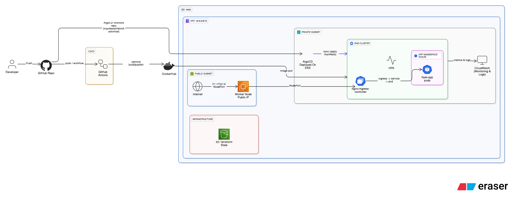

# CloudDevOpsProject

**End-to-end DevOps Project** demonstrating modern infrastructure provisioning, CI/CD, and GitOps using Docker, Kubernetes, Terraform, Ansible, Jenkins, ArgoCD, and GitHub Actions.

---

## Author

**Zeyad Elgohari** — Cloud & DevOps Engineer  
- GitHub: [github.com/ziadtd](https://github.com/ziadtd)  
- LinkedIn: [linkedin.com/in/ziadtd](https://linkedin.com/in/ziadtd)  
- Email: ziadtareqd22@gmail.com  

--- 

## Project Overview

This project showcases the design and deployment of a fully automated DevOps workflow:

- **Containerization:** Python Flask application packaged in Docker.
- **Orchestration:** Kubernetes manifests deployed on AWS EKS.
- **Infrastructure as Code:** Terraform modules for networking, Jenkins server, and EKS cluster.
- **Configuration Management:** Ansible playbooks for server setup and automation.
- **Continuous Integration:** Jenkins pipeline & GitHub Actions for automated builds, tests, and image publishing.
- **Continuous Deployment / GitOps:** ArgoCD for automated, declarative application deployment.
- **Monitoring:** AWS CloudWatch dashboards and metric alarms.

---

## Architecture Overview

**Components:**

| Component      | Description                                                                 |
|----------------|-----------------------------------------------------------------------------|
| Docker         | Packages Flask app with all dependencies.                                   |
| Kubernetes     | Orchestrates containers; provides scalability and service discovery.       |
| Terraform      | Creates AWS infrastructure: VPC, subnets, security groups, EKS cluster.    |
| Ansible        | Automates server setup (Jenkins, Docker, Git, Java).                        |
| Jenkins/GitHub Actions        | CI/CD pipeline for building, testing, and deploying Docker images.         |
| ArgoCD         | GitOps-based deployment to Kubernetes cluster.                              |
| CloudWatch     | Monitors infrastructure and application metrics.                            |

---

## Flow Description:

1. Developer pushes code to GitHub.
2. Jenkins or GitHub Actions builds Docker image and pushes to DockerHub.
3. Kubernetes manifests are applied on EKS.
4. ArgoCD monitors repository and automatically syncs updates to cluster.
5. Application is live and monitored via CloudWatch.

---

## Quick Start

For detailed instructions, see the component-specific documentation in the [Docs](docs/) folder:
| Component      | Documentation                                  |
| -------------- | ---------------------------------------------- |
| Repo Setup     | [Repo Setup](docs/repo.md)                     |
| Docker         | [Docker Setup](docs/docker.md)                 |
| Kubernetes     | [Kubernetes Deployment](docs/kubernetes.md)    |
| Terraform      | [Terraform Infrastructure](docs/terraform.md)  |
| Ansible        | [Ansible Automation](docs/ansible.md)          |
| Jenkins/GitHub Actions        | [CI/CD](docs/cicd.md)                          |
| ArgoCD         | [ArgoCD GitOps](docs/argocd.md)                |

---

## Project Deliverables

Docker Images: [DockerHub Repository](https://hub.docker.com/repository/docker/ziadtd/flask-app/general)

Terraform Modules: [Terraform](terraform/)

Kubernetes Manifests: [Kubernetes](kubernetes/)

Ansible Playbooks: [Ansible](ansible/)

CI/CD Pipeline Files: [Jenkins Shared Library](jenkins/)  & [GitHub Actions Workflow](.github/)

---

## Technologies & Tools

- Languages & Frameworks: Python, Flask, YAML, Groovy
- Containerization: Docker
- Orchestration: Kubernetes, Nginx Ingress Controller
- CI/CD: Jenkins, GitHub Actions
- GitOps: ArgoCD
- Infrastructure: Terraform on AWS (VPC, EC2, EKS)
- Configuration Management: Ansible
- Monitoring: AWS CloudWatch